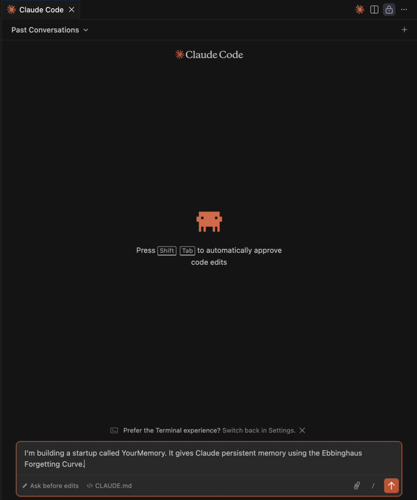

# YourMemory

**MCP memory server for AI agents. Biological decay keeps context sharp. 59% Recall@5 on LoCoMo-10. Two commands to install.**

Persistent memory for Claude and any MCP-compatible AI — works like human memory. Important things stick, forgotten things fade, outdated facts get pruned automatically. Related memories stay alive longer through a graph layer that understands connections between them.



---

## Benchmarks

Without persistent memory, your AI assistant asks the same questions every session — re-learning your stack, your preferences, your constraints from scratch. YourMemory fixes that with a hybrid BM25 + vector + knowledge graph pipeline that retrieves what matters, ranked by biological decay.

**Dataset:** [snap-research/LoCoMo](https://github.com/snap-research/locomo) — `locomo10.json`, 10 multi-session conversation samples, **1,534 QA pairs**, categories 1–4.

**Script:** [`benchmarks/locomo_4way.py`](https://github.com/sachitrafa/YourMemory/blob/main/benchmarks/locomo_4way.py) — fully reproducible, no special tuning. All API keys loaded from environment variables; no hardcoded credentials.

**Metric:** Recall@5 — does the correct answer appear in the top-5 retrieved chunks?

**Hit rule:** exact substring match OR ≥50% meaningful-token overlap (tokens with len > 3), applied identically to all systems.

| System | Recall@5 | Hits | 95% CI | Samples |
|--------|:--------:|:----:|:------:|:-------:|
| **YourMemory** (BM25 + vector + graph + decay) | **59%** | 899/1,534 | 56–61% | 10/10 |
| Zep Cloud | 28% | 428/1,534 | 26–30% | 10/10 |

Supermemory and Mem0 were included in the run but exhausted their free-tier API quotas mid-benchmark (Supermemory after sample 4, Mem0 after sample 6) — their partial results are in [`benchmarks/locomo_4way_results.json`](https://github.com/sachitrafa/YourMemory/blob/main/benchmarks/locomo_4way_results.json).

Full per-sample breakdown and methodology in [BENCHMARKS.md](BENCHMARKS.md).
Read the writeup: [I built memory decay for AI agents using the Ebbinghaus forgetting curve](https://dev.to/sachit_mishra_686a94d1bb5/i-built-memory-decay-for-ai-agents-using-the-ebbinghaus-forgetting-curve-1b0e)

---

## How it works

### Ebbinghaus Forgetting Curve

```
base_λ      = DECAY_RATES[category]
effective_λ = base_λ × (1 - importance × 0.8)
strength    = importance × e^(-effective_λ × days) × (1 + recall_count × 0.2)
score       = cosine_similarity × strength
```

Decay rate varies by **category** — failure memories fade fast, strategies persist longer:

| Category | base λ | survives without recall | use case |
|----------|--------|------------------------|----------|
| `strategy` | 0.10 | ~38 days | What worked — successful patterns |
| `fact` | 0.16 | ~24 days | User preferences, identity |
| `assumption` | 0.20 | ~19 days | Inferred context |
| `failure` | 0.35 | ~11 days | What went wrong — environment-specific errors |

Importance additionally modulates the decay rate within each category. Memories recalled frequently gain `recall_count` boosts that counteract decay. Memories below strength `0.05` are pruned automatically.

### Hybrid Vector + Graph Engine (v1.3.0)

Retrieval runs in two rounds:

**Round 1 — Vector search:** cosine similarity against all memories. Returns top-k above the similarity threshold.

**Round 2 — Graph expansion:** BFS traversal from Round 1 seeds. Surfaces memories that are *related* to the top results but scored below the similarity cut-off — memories that share context but not vocabulary.

```
recall("Python backend")
  Round 1 → [1] Python/MongoDB (sim=0.61), [2] DuckDB/spaCy (sim=0.19)
  Round 2 → [5] Docker/Kubernetes (sim=0.29, below cut-off but graph neighbour of [1])
            surfaced via graph even though vector search missed it
```

**Chain-aware pruning:** A memory is kept alive if any of its graph neighbours is still above the prune threshold. Related memories age together — one strong memory protects an entire connected cluster from being deleted.

**Recall propagation:** Recalling a memory automatically boosts `recall_count` of its graph neighbours. Frequently-accessed memories keep their related context fresh.

**Semantic edges:** Graph edges are created based on cosine similarity (threshold ≥ 0.4), not insertion order. Edge weight = `similarity × verb_weight` from the SVO predicate extracted by spaCy.

---

## Setup

**Zero infrastructure required** — uses DuckDB out of the box. Two commands and you're done.

Supports **Python 3.11, 3.12, 3.13, and 3.14**.

### 1. Install

```bash
pip install yourmemory
```

All dependencies installed automatically. No clone, no Docker, no database setup.

### 2. Run setup (once)

```bash
yourmemory-setup
```

Downloads the spaCy language model and initialises the database. Run this once after install.

### 3. Get your config

```bash
yourmemory-path
```

Prints your full executable path and a ready-to-paste config for any MCP client. Copy it.

### 4. Wire into your AI client

The database is created automatically at `~/.yourmemory/memories.duckdb` on first use.

#### Claude Code

Add to `~/.claude/settings.json`:

```json
{
  "mcpServers": {
    "yourmemory": {
      "command": "yourmemory"
    }
  }
}
```

Reload Claude Code (`Cmd+Shift+P` → `Developer: Reload Window`).

#### Cline (VS Code)

VS Code doesn't inherit your shell PATH. Run this in terminal to get the exact config to paste:

```bash
yourmemory-path
```

Then in Cline → **MCP Servers** → **Edit MCP Settings**, paste the output. It looks like:

```json
{
  "mcpServers": {
    "yourmemory": {
      "command": "/full/path/to/yourmemory",
      "args": [],
      "env": {
        "YOURMEMORY_USER": "your_name",
        "DATABASE_URL": ""
      }
    }
  }
}
```

Restart Cline after saving.

#### Cursor

Add to `~/.cursor/mcp.json`:

```json
{
  "mcpServers": {
    "yourmemory": {
      "command": "/full/path/to/yourmemory",
      "args": [],
      "env": {
        "YOURMEMORY_USER": "your_name",
        "DATABASE_URL": ""
      }
    }
  }
}
```

#### Claude Desktop

Add to `~/Library/Application Support/Claude/claude_desktop_config.json` (macOS) or `%APPDATA%\Claude\claude_desktop_config.json` (Windows):

```json
{
  "mcpServers": {
    "yourmemory": {
      "command": "yourmemory"
    }
  }
}
```

Restart Claude Desktop.

#### OpenCode

Add to `~/.config/opencode/config.json`:

```json
{
  "mcp": {
    "yourmemory": {
      "type": "local",
      "command": ["yourmemory"],
      "environment": {
        "YOURMEMORY_USER": "your_name"
      }
    }
  }
}
```

Run `yourmemory-path` in your terminal first if `yourmemory` isn't on your PATH — replace `"yourmemory"` with the full path it prints.

Then add the memory workflow to your OpenCode instructions:

```bash
cp sample_CLAUDE.md ~/.config/opencode/instructions.md
```

Restart OpenCode after saving.

#### Any MCP-compatible client

YourMemory is a standard stdio MCP server. Works with Claude Code, Claude Desktop, Cline, Cursor, OpenCode, Windsurf, Continue, and Zed. Use the full path from `yourmemory-path` if the client doesn't inherit shell PATH.

### 5. Add memory instructions to your project

Copy `sample_CLAUDE.md` into your project root as `CLAUDE.md` and replace:
- `YOUR_NAME` — your name (e.g. `Alice`)
- `YOUR_USER_ID` — used to namespace memories (e.g. `alice`)

Claude will now follow the recall → store → update workflow automatically on every task.

---

## Multi-Agent Shared and Private Memory

Multiple AI agents can share the same YourMemory instance — each with its own identity, isolated private memories, and controlled access to shared context.

### How it works

Every memory has two fields that control visibility:

| Field | Values | Meaning |
|---|---|---|
| `visibility` | `shared` (default) | Any agent (or the user) can recall this memory |
| `visibility` | `private` | Only the agent that stored it can recall it |
| `agent_id` | e.g. `"coding-agent"` | Which agent owns this memory |

Agents authenticate with an **API key** (prefix `ym_`). Without a key, the caller is treated as the user and can only read/write `shared` memories.

### Registering an agent

```python
from src.services.api_keys import register_agent

result = register_agent(
    agent_id="coding-agent",
    user_id="sachit",
    description="Handles code review and refactoring tasks",
    can_read=["shared", "private"],   # what this agent can read
    can_write=["shared", "private"],  # what it can write
)

print(result["api_key"])  # ym_xxxx — save this, shown once only
```

The key is hashed with SHA-256 before storage. The plaintext is never stored — if lost, revoke and re-register.

### Using the API key in MCP calls

Pass `api_key` to any MCP tool call:

```python
# Store a private memory — only this agent can recall it
store_memory(
    content="The auth service on staging uses a self-signed cert — skip SSL verify",
    importance=0.7,
    category="failure",
    api_key="ym_xxxx",
    visibility="private"
)

# Store shared context — any agent can recall it
store_memory(
    content="Production database is on PostgreSQL 16, us-east-1",
    importance=0.8,
    category="fact",
    api_key="ym_xxxx",
    visibility="shared"
)

# Recall — returns shared memories + this agent's private memories
recall_memory(
    query="database production",
    api_key="ym_xxxx"
)
```

Without `api_key`, recall returns **shared memories only**.

### Access control

When registering an agent, `can_read` controls which visibility tiers the agent can access:

```python
# Read-only agent — can see shared context but cannot store private memories
register_agent(
    agent_id="readonly-summarizer",
    user_id="sachit",
    can_read=["shared"],
    can_write=["shared"],
)

# Isolated agent — private memory only, cannot read shared context
register_agent(
    agent_id="isolated-agent",
    user_id="sachit",
    can_read=["private"],
    can_write=["private"],
)
```

### Example: two agents sharing context

```
coding-agent stores:
  → "Sachit uses pytest for all Python tests"  (shared, importance=0.8)
  → "Staging API key is sk-staging-xxx"         (private, importance=0.9)

review-agent recalls "Python testing":
  ← "Sachit uses pytest for all Python tests"   ✓ (shared — visible)
  ← "Staging API key is sk-staging-xxx"          ✗ (private — hidden)

coding-agent recalls "Python testing":
  ← "Sachit uses pytest for all Python tests"   ✓ (shared)
  ← "Staging API key is sk-staging-xxx"          ✓ (private — owns it)
```

### Revoking an agent

```python
from src.services.api_keys import revoke_agent

revoke_agent(agent_id="coding-agent", user_id="sachit")
# Key is invalidated immediately — all future calls with it return 401
```

---

## MCP Tools

| Tool | When to call |
|------|-------------|
| `recall_memory` | Start of every task — surface relevant context |
| `store_memory` | After learning a new preference, fact, failure, or strategy |
| `update_memory` | When a recalled memory is outdated or needs merging |

`store_memory` accepts an optional `category` parameter to control decay rate:

```python
# Failure — decays in ~11 days (environment changes fast)
store_memory(
    content="OAuth for client X fails — redirect URI must be app.example.com",
    importance=0.6,
    category="failure"
)

# Strategy — decays in ~38 days (successful patterns stay relevant)
store_memory(
    content="Cursor pagination fixed the 30s timeout on large user queries",
    importance=0.7,
    category="strategy"
)
```

### Example session

```
User: "I prefer tabs over spaces in all my Python projects"

Claude:
  → recall_memory("tabs spaces Python preferences")   # nothing found
  → store_memory("Sachit prefers tabs over spaces in Python", importance=0.9, category="fact")

Next session:
  → recall_memory("Python formatting")
  ← {"content": "Sachit prefers tabs over spaces in Python", "strength": 0.87}
  → Claude now knows without being told again
```

---

## Decay Job

Runs automatically every 24 hours on startup — no cron needed. Memories below strength `0.05` are pruned.

**Chain-aware pruning (v1.3.0):** Before deleting a decayed memory, the decay job checks its graph neighbours. If any neighbour is still above the prune threshold, the memory is kept alive. This prevents isolated deletion of facts that are part of a related cluster.

---

## Stack

- **DuckDB** — default backend, zero setup, native vector similarity (same quality as pgvector)
- **NetworkX** — default graph backend, zero setup, persists at `~/.yourmemory/graph.pkl`
- **Neo4j** — opt-in graph backend for scale: `pip install 'yourmemory[neo4j]'`, set `GRAPH_BACKEND=neo4j`
- **sentence-transformers** — local embeddings (`all-mpnet-base-v2`, 768 dims, no external service needed)
- **spaCy 3.8.13+** — local NLP for deduplication, categorization, and SVO triple extraction (Python 3.11–3.14 compatible)
- **APScheduler** — automatic 24h decay job
- **MCP** — Claude integration via Model Context Protocol
- **PostgreSQL + pgvector** — optional, for teams / large datasets

---

## Architecture

```
Claude / Cline / Cursor / Any MCP client
    │
    ├── recall_memory(query, api_key?)
    │       └── embed → cosine similarity (Round 1)
    │           → graph BFS expansion (Round 2)
    │           → score = sim × strength → top-k
    │           → recall propagation → boost graph neighbours
    │
    ├── store_memory(content, importance, category?, api_key?, visibility?)
    │       └── is_question? → reject
    │           contradiction check → update existing if conflict
    │           embed() → INSERT memories
    │           → index_memory() → upsert graph node + semantic edges
    │
    └── update_memory(id, new_content, importance)
            └── embed(new_content) → UPDATE memories
                → update graph node strength

Vector DB (Round 1)          Graph DB (Round 2)
DuckDB (default)             NetworkX (default)
  memories.duckdb              graph.pkl
  ├── embedding FLOAT[768]     ├── nodes: memory_id, strength
  ├── importance FLOAT         └── edges: sim × verb_weight ≥ 0.4
  ├── recall_count INTEGER
  ├── visibility VARCHAR     Neo4j (opt-in, GRAPH_BACKEND=neo4j)
  └── agent_id VARCHAR         └── bolt://localhost:7687

Agent Registry
  agent_registrations
  ├── agent_id VARCHAR
  ├── api_key_hash VARCHAR   ← SHA-256, plaintext never stored
  ├── can_read  []           ← ["shared"] | ["private"] | both
  ├── can_write []
  └── revoked_at TIMESTAMP
```

---

## PostgreSQL (optional — for teams or large datasets)

Install with Postgres support:

```bash
pip install yourmemory[postgres]
```

Then create a `.env` file:

```bash
DATABASE_URL=postgresql://YOUR_USER@localhost:5432/yourmemory
```

The backend is selected automatically — `postgresql://` in `DATABASE_URL` → Postgres + pgvector, anything else → DuckDB.

**macOS**
```bash
brew install postgresql@16 pgvector && brew services start postgresql@16
createdb yourmemory
```

**Ubuntu / Debian**
```bash
sudo apt install postgresql postgresql-contrib postgresql-16-pgvector
createdb yourmemory
```

---

## Dataset Reference

Benchmarks use the [LoCoMo](https://github.com/snap-research/locomo) dataset by Snap Research — a public long-context memory benchmark for multi-session dialogue.

> Maharana et al. (2024). *LoCoMo: Long Context Multimodal Benchmark for Dialogue.* Snap Research.

---

## License

Copyright 2026 **Sachit Misra**

Licensed under [CC-BY-NC-4.0](LICENSE) (Creative Commons Attribution-NonCommercial 4.0).

**Free for:** personal use, education, academic research, open-source projects.

**Not permitted:** commercial use of any kind — including SaaS, internal tooling at for-profit companies, or paid services — without a separate written agreement.

For commercial licensing: mishrasachit1@gmail.com
